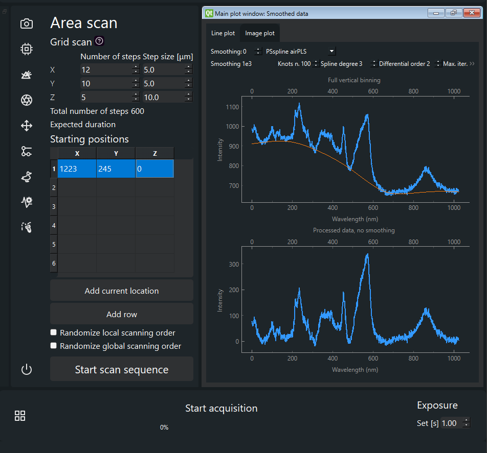

# Raman flow atutomation platform

This is a user interface and an automation platform combining Andor spectrograph and camera with a number of peripherals including a data acquisition card (DAQ) a shutter a Fluidgent pressure driven flow controller and a microscope stage. 



## Install git in Anaconda
To acess and overwrite your branch in the git repository, you should installa git first. It is a command line program that you can install into your development environment in your computer using the command
```bash
conda install -c anaconda git
```

## Basic git functioning (TLDR)
In a nutshell, in the git environment, you can create a clone of the main environment to work on. This clone is called a branch. This is your version of the code to play with and do whatever you want. You can also have multiple branches if it helps your workflow. Once you have developed a new feature in your branch and it has been tested, you can merge your branch to the main version of the program, thus updating it. This merging should be done in a controlled manner and probably only once in a while after we meet and all agree on it. 

When you will have installed git in your anacodna environment, you will download the repository using a link in this website. Then you will get all the files in your computer and you can edit them whichever way you prefer. When you will have made some new addition, you can upload it back, I think this process is called commiting. At that point, you should create your own branch and upload to it. When uploading, you will be asked to add a commit message, which is supposed to describe what you have done. This is useful for you and for the rest of the team. 

When you start working with your local RACS version, it is a good idea to check it against the online repository since most issues arise when you start editing your local version and the online is somehow ahead of you. The resulting changes are hard to reconsile. Check your status with 
```bash
git status 
```
**Make sure you are working on the correct branch.** You will also see if there are any untracked files. If you wish to track them, you can add them as instructed in the message. 

Once you have resolved tracked files and if everything comes clear, you can start working. After you have edited your code, it is a good idea to check your status again with `git status` or `git checkout`. They are somewhat analogous for all I understand. You should see uncommited changes. Commit these using the command:
```bash
git commit -m "Your message"
```
Afterwards you can check once more with `git status`. **Make sure you are working on the correct branch**. If everything comes out clean, you can upload your changes using the push command.
```bash
git push
```


I suggest you familiarize yourself with the general git functioning by yourself, as this is by no means a complete overview and I am definitely not an expert. 

## Branch rules for this repository
Our main branch cannot be currently protected. That means that it can be rewritten by any of us. For this reason, I suggest being quite careful with it. It should be our stable environment that is deployed and working on the machine. The best is probably to create a new branch for yourself as the first step before you do anything else. Then you can clone (download) it into  your computer using the following command with an address that you can retrieve in the green button in the top right corner that says `<> code`.
```bash
git clone https://github.com/YOUR-USERNAME/YOUR-REPOSITORY --branch YOURBRANCH
```
Then you can check the status of your repository with:
```bash
git checkout
```
This will produce a message akin to this one `Your branch is up to date with 'origin/adamdev'`. It is a good idea to use `git checkout` quite often whenever you change something, because it will inform you about any files that might not be part of the git repository but exist in your folder. This can happen when you just copy a new file or folder into your git folder in your computer. If you want it to be tracked, you need to specifically add to the repository in your branch. 

If you want to update a specific file from a different branch (such as README.md), you can do that following this example.
```bash
# Pulling updated information from the server.
git fetch
# Fetching the specific file
git restore -s origin/main -- README.md
git add README.md
# Checking the current status (sanity check). Check it is your branch!
git checkout
git commit -m "Updating from the main branch."
# Updating your files online in your branch.
git push
```
## Program installation
The anaconda environment is supplied in the Andor2.yaml file. It should be possible to clone this environment and install most of the relevant packages from there. The installation will fail at the end due to several packages not being lised online. These are:
- pyAndorSDK2 (provided by Andor)
- pyAndorSpectrograph (provided by Andor)
- Fluidgen driver
  
The Python driver for these can be found in this git file and the installation instructions are in pdf files within. After installing these drivers into the newly generated environment, you can run the following command:

```bash
conda env update --name myenv --file local.yml
```
This will go through the yaml file once again and check all the elements. This operation should be successful now. Additinally, the stage driver (PriorSDK) is already included in the program folder and does not need to be installed. 

## Adding new icons to the set

File paths of all icons in the `.svg` format are collected in the `icons.qml` file. They need to be added manually following the pattern present. Try to keep the files in an alphabetical order.  

Icons saved in the `icons.qml` file must be exported to the `icons_rc.py` file using the following command:

```bash
# Either
pyrcc5 icons.qrc -o icons_rc.py
```
The `pyrcc5` is designed for PyQt5. It works for PyQt6, however the import line on the top of the resulting file `icons_rc.py` must be changed to the following:

```python
from PyQt6 import QtCore
```
